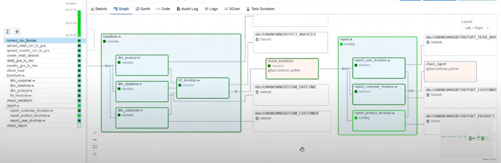

# Retail Analytics Project

# Data Pipeline Architecture

This repository contains a data pipeline architecture using modern data stack technologies.

## Architecture Diagram

```mermaid
flowchart LR
    subgraph "Data Sources"
        CSV["CSV Files"]
        JSON["JSON Files"]
    end

    subgraph "Apache Airflow"
        Ingest["Data Ingestion"]
        QC1["Quality Check"]
    end

    subgraph "Google BigQuery"
        Dataset["BigQuery Dataset"]
        Raw1["raw_sales table"]
        Raw2["raw_store table"]
        QC2["Quality Check"]
    end

    subgraph "Soda"

      subgraph "dbt Core - Data Modeling"
          DimP["dim_product"]
          DimSu["dim_supplier"]
          DimSt["dim_store"]
          Fact["fct_sales"]
          DataModel["Data Modeling"]
          QC3["Quality Check"]
      end

    end

    subgraph "Metabase"

      subgraph "dbt Core - Reporting"
          RepS["report_sales"]
          RepC["report_category"]
          RepM["report_monthly"]
          ReportBuild["Report Building"]
          QC4["Quality Check"]
          Dashboard["Dashboard"]
      end
      
    end

    CSV --> Ingest
    JSON --> Ingest
    Ingest --> QC1
    QC1 --> Dataset

    Dataset --> Raw1
    Dataset --> Raw2
    Raw1 --> QC2
    Raw2 --> QC2

    QC2 --> DataModel
    DataModel --> DimP
    DataModel --> DimSu
    DataModel --> DimSt
    DataModel --> Fact
    DimP & DimSu & DimSt & Fact --> QC3

    QC3 --> ReportBuild
    ReportBuild --> RepS
    ReportBuild --> RepC
    ReportBuild --> RepM
    RepS & RepC & RepM --> QC4
    QC4 --> Dashboard

    classDef airflow fill:#1DA1F2,stroke:#333,stroke-width:1px;
    classDef bigquery fill:#4285F4,stroke:#333,stroke-width:1px;
    classDef dbt fill:#FF694B,stroke:#333,stroke-width:1px;
    classDef metabase fill:#509EE3,stroke:#333,stroke-width:1px;

    class Ingest,QC1 airflow;
    class Dataset,Raw1,Raw2,QC2 bigquery;
    class DimP,DimSu,DimSt,Fact,DataModel,QC3,RepS,RepC,RepM,ReportBuild,QC4 dbt;
    class Dashboard metabase;
```



_Using Airflow, BigQuery, Google Cloud Storage, dbt, Soda, Metabase and Python_

## Overview

This project implements an end-to-end data pipeline processing retail data. The pipeline includes data modeling into fact-dimension tables, data quality checks, and cloud storage integration, showcasing modern data stack technologies.

## Tech Stack

- **Python** - Core programming language
- **Docker & Docker Compose** - Containerization
- **Apache Airflow** - Workflow orchestration
- **Google Cloud Platform**:
  - Google Cloud Storage - Data lake
  - BigQuery - Data warehouse
- **dbt** - Data transformation
- **Soda.io** - Data quality
- **Metabase** - Data visualization

## Project Structure

```
├── dags/              # Airflow DAG definitions
│   └── retail.py      # Main retail pipeline DAG
├── docs/              # Documentation
│   └── images/        # Project diagrams
├── include/           # Project resources
│   ├── datasets/      # Source data files
│   ├── dbt/          # dbt transformations
│   ├── gcp/          # GCP credentials
│   └── soda/         # Data quality checks
```

## Prerequisites

1. [Docker Desktop](https://docs.docker.com/desktop/)
2. [Astronomer CLI](https://www.astronomer.io/docs/astro/cli/install-cli)
3. Google Cloud Platform account
4. Soda Cloud account

## Setup Instructions

### 1. Clone the Repository

```bash

# Or using Git
git clone https://github.com/Debyvypth1862/retail_analytics_data_project.git
```

### 2. Initialize Airflow Project

```bash
astro dev init
# Confirm with 'y' when prompted
```

### 3. Configure GCP

1. Create a new project at [console.cloud.google.com](https://console.cloud.google.com)
2. Update project ID in:

   - `.env` (GCP_PROJECT_ID)
   - `include/dbt/models/sources/sources.yml` (database)
   - `include/dbt/profiles.yml` (project)

3. Create a GCS bucket:
   - Go to [Cloud Storage Browser](https://console.cloud.google.com/storage/browser)
   - Create bucket named `<yourname>_online_retail`
   - Update `bucket_name` in `dags/retail.py`

### 4. Setup Service Account

1. In IAM, create service account `airflow-online-retail`
2. Grant admin access for:
   - Google Cloud Storage
   - BigQuery
3. Export JSON key as `service_account.json`
4. Create `include/gcp/` folder and place key file there

### 5. Start Airflow



```bash
astro dev start
```

Access Airflow at http://localhost:8080 (admin/admin)

### 6. Configure Airflow Connection

1. Go to Admin → Connections
2. Add new Google Cloud connection:
   - Connection Id: `gcp`
   - Connection Type: `Google Cloud`
   - Keypath: `/usr/local/airflow/include/gcp/service_account.json`

### 7. Configure Soda

1. Create account at [soda.io](https://www.soda.io/)
2. Generate API key from your profile
3. Update `include/soda/configuration.yml` or `.env` with:

```yaml
soda_cloud:
  host: cloud.us.soda.io # Use cloud.eu.soda.io for EU region
  api_key_id: <KEY>
  api_key_secret: <SECRET>
```

### 8. Setup Metabase

1. Access Metabase at http://localhost:3000
2. Create account and connect to BigQuery:
   - Display name: `BigQuery_DW`
   - Project ID: Your GCP project ID
   - Service Account Key: Upload `service_account.json`

## Running the Pipeline

1. Access Airflow UI at http://localhost:8080
2. Enable and trigger the `retail` DAG
3. Monitor execution in:
   - Airflow UI
   - GCP Console (Storage & BigQuery)
   - Soda Cloud Dashboard
4. Create visualizations in Metabase

## Dataset Information

The project uses two main datasets in `include/datasets/`:

- `online_retail.csv` - Original dataset
- `country.csv` - Generated from BigQuery

## SQL Reports Navigation

All report SQL files are located in `include/dbt/models/report/`. Below is a detailed breakdown of each report:

### 1. Sales Overview (`report_sales_overview.sql`)
```sql
Location: include/dbt/models/report/report_sales_overview.sql

Purpose: Provides daily and country-level sales metrics
Key Metrics:
- Total Transactions (COUNT DISTINCT invoice_id)
- Total Customers (COUNT DISTINCT customer_id)
- Total Revenue (SUM total)

Features:
- Daily aggregation by date
- Country-level aggregation
- Unified view using UNION ALL
```

### 2. Customer Analysis (`report_customer_analysis.sql`)
```sql
Location: include/dbt/models/report/report_customer_analysis.sql

Purpose: Customer segmentation and behavior analysis
Key Metrics:
- Total Transactions per customer
- Average Basket Size
- Customer Revenue
- Months Active

Segmentation:
- Loyal: ≥6 months active
- Regular: 3-5 months active
- New: <3 months active
```

### 3. Product Performance (`report_product_performance.sql`)
```sql
Location: include/dbt/models/report/report_product_performance.sql

Purpose: Comprehensive product analytics
Key Metrics:
- Total Quantity Sold
- Total Revenue
- Average Unit Price
- Sales Count
- Geographic Spread

Features:
- Product ranking by revenue and quantity
- Country-wise distribution
- Sales performance tracking
```

### 4. Time-Based Analysis (`report_time_analysis.sql`)
```sql
Location: include/dbt/models/report/report_time_analysis.sql

Purpose: Temporal analysis of sales patterns
Time Dimensions:
- Hour of Day
- Day of Week
- Month
- Year

Key Features:
- Time period categorization:
  * Morning (6-11)
  * Afternoon (12-17)
  * Evening (18-23)
  * Night (0-5)
- Moving average calculations
- Peak sales identification
```

### 5. Geographic Analysis (`report_geographic_analysis.sql`)
```sql
Location: include/dbt/models/report/report_geographic_analysis.sql

Purpose: Country-level performance analysis
Key Metrics:
- Country Revenue
- Unique Products per Country
- Customer Count
- Top Products

Features:
- Revenue ranking by country
- Top 3 products per country
- Market penetration metrics
```

### 6. Supplementary Reports

#### Customer Invoices (`report_customer_invoices.sql`)
```sql
Location: include/dbt/models/report/report_customer_invoices.sql

Purpose: Top 10 countries by revenue
Metrics:
- Total Invoices per Country
- Total Revenue per Country
```

#### Product Invoices (`report_product_invoices.sql`)
```sql
Location: include/dbt/models/report/report_product_invoices.sql

Purpose: Top 10 products by quantity
Metrics:
- Total Quantity Sold
- Product Details (ID, Code, Description)
```

#### Year Invoices (`report_year_invoices.sql`)
```sql
Location: include/dbt/models/report/report_year_invoices.sql

Purpose: Temporal revenue analysis
Metrics:
- Monthly Invoice Count
- Monthly Revenue
- Year-over-Year Comparisons
```

## Data Quality Checks

Each report includes comprehensive data quality checks:

- Validation of key metrics (no negative values)
- Completeness checks for critical fields
- Data integrity validation
- Time series continuity checks
- Geographic data validation

## Accessing the Reports

1. **Metabase Dashboards**

   - URL: http://localhost:3000
   - Login with your credentials
   - Navigate to Dashboards section

2. **dbt Documentation**

   - Contains detailed documentation of all metrics
   - Data lineage information
   - Field-level descriptions

3. **Soda Data Quality**
   - Monitor data quality in real-time
   - Access data quality dashboards
   - View historical quality metrics

## Using the Reports

### In dbt
```bash
# Run all reports
dbt run --models report.*

# Run specific report
dbt run --models report.report_sales_overview
```

### In Metabase
1. Access reports via preconfigured dashboards
2. Create custom visualizations using the report models
3. Schedule automated updates

### Data Freshness
- Reports are updated daily through Airflow DAG
- Last update timestamp available in Metabase
- Data quality status visible in Soda Cloud

## Contact

- [LinkedIn](https://www.linkedin.com/in/debypham/)
- [GitHub](https://github.com/Debyvypth1862)
- [vypmon@gmail.com](mailto:vypmon@gmail.com)
